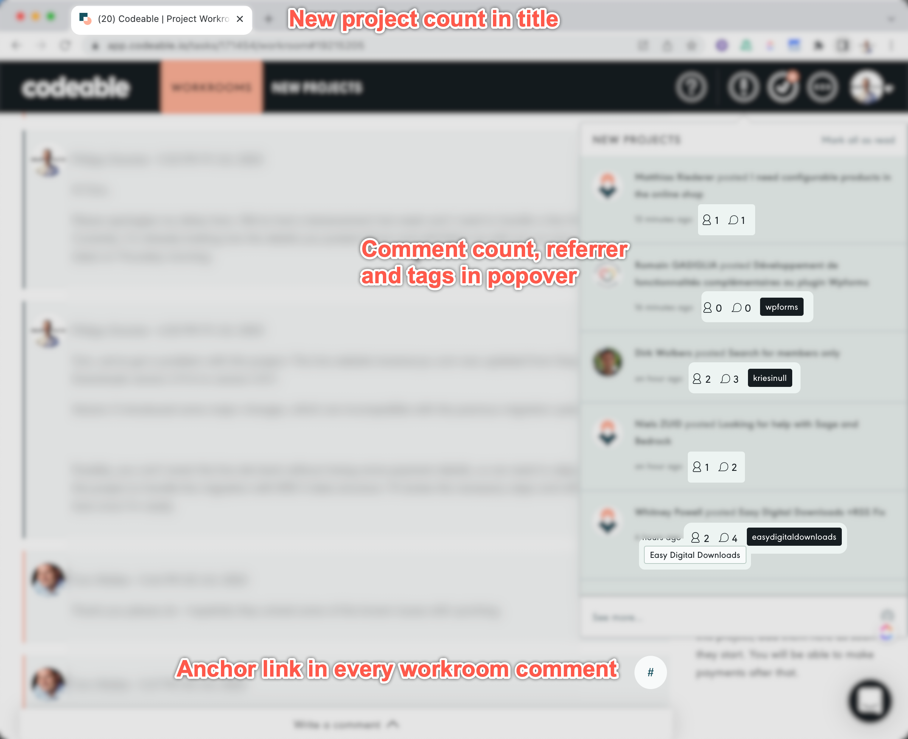

# Chrome Extension: Codeable Extension

> This is a modified version of the extension by Chris Gustin - <https://chrome.google.com/webstore/detail/codeable-notifications/dhdjcolacmfiingemgilegoapcpemfmf>
>
> ------
>
> *Shows the number of unread Codeable notifications in the document title (Gmail style)*
>
> *For Codeable experts, this extension will show the number of unread notifications in the page tab when signed into the Codeable app. It will also show the total comment and expert counts for each notification in the new projects popup widget. This extension will only work with the dashboard area of app.codeable.io and is not compatible with other sites or domains.*

## Additions

1. Show the **referrer** in the "New Projects" popup
1. Show matching **personal skill** in the "New Projects" popup (i.e. matching tags between your profile and the project)
1. Adds an **anchor link** to every comment inside a workroom

## Installation

1. Clone this repo to the local machine
2. Open the website `chrome://extensions/` in Chrome
3. Enable "Developer Mode" on the Extensions page
4. Click on the "Load unpacked" button
5. Select the local copy of the git repository, from step 1
6. Disable "Developer Mode" again

**Screenshots**

